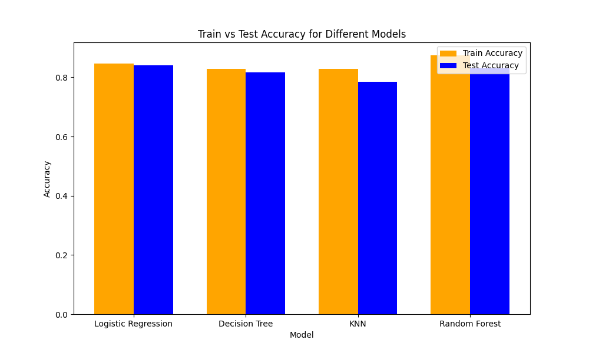

# StudentDepressionAnalysis
# Student Depression Prediction Project

## 🎯 **Proje Amacı**
Bu projenin temel amacı, öğrenci depresyonunun erken tespitini ve doğru tahminini sağlamaktır. Öğrencilerin demografik verileri, akademik başarıları, yaşam tarzları ve psikolojik geçmişleri gibi çeşitli faktörler analiz edilerek depresyon seviyeleri incelenmiştir. Bu analizler, öğrencilere yönelik uygun müdahale stratejilerinin geliştirilmesine olanak tanımakta ve ruh sağlığı alanında erken önlemler alınmasına yardımcı olmaktadır.

## 📂 **Dataset Hakkında**

**Kaynak:** [Dosya Eklendi](datasets/mobile-device-usage-and-user-behavior-dataset)  
Dataset, öğrenci depresyonu üzerinde etkili olabilecek farklı faktörleri içermektedir. 

### **Özellikler:**
- **Boyut:** 20.000+ veri örneği (örnek sayısını datasetten doğrulayabilirsiniz).
- **Özellik Sayısı:** 18+ (örnek sayısını datasetten doğrulayabilirsiniz).
- **Veri Türleri:** Nümerik, kategorik, metinsel.
- **Hedef Değişken:** Depresyon seviyesi 
- **Dağılımlar:** Veri sınıf dengesizlikleri analiz edilerek çözülmüştür.

## 🔧 **Proje Adımları**

### 1. **Veri Ön İşleme (Preprocessing)**
- Eksik ve tutarsız veriler tespit edilip dolduruldu.
- Veriler normalize ve standardize edilerek uygun formatta hazırlandı.
- Anlamlı özellikler seçilerek veri analizi güçlendirildi.

### 2. **Veri Analizi**
- Veri seti grafiklerle incelendi (histogramlar, scatter plot'lar, korelasyon matrisleri).
- Sınıf dengesizliği tespit edilip SMOTE gibi teknikler uygulandı.

### 3. **Makine Öğrenmesi Modelleri**
- **Seçilen Modeller:**
  - Decision Tree
  - Random Forest
  - Support Vector Machine (SVM)
  - Logistic Regression
- Modeller farklı hiperparametrelerle optimize edilerek eğitildi.
- Veri bölme işlemi Hold-Out yöntemiyle %80 eğitim ve %20 test olarak yapıldı.
- Overfitting sorunları tespit edilip giderildi.

### 4. **Performans Değerlendirme**
- Modeller Accuracy, Precision, Recall ve F1-Score gibi metriklerle değerlendirildi.
- Sonuçlar karşılaştırmalı bir tablo ile sunuldu.

### 5. 📊 **Sonuçlar**
### Sonuç Grafiği
Aşağıdaki grafik, modellerin doğruluk performanslarını göstermektedir:

### Logistic Regression
- **Test Doğruluğu:** 0.8400
- **Precision (1):** 0.85
- **Recall (1):** 0.88
- Model, azınlık sınıfını doğru şekilde sınıflandırma konusunda başarılı sonuçlar elde etmiştir.

### Decision Tree
- **Test Doğruluğu:** 0.8176
- **Precision (1):** 0.83
- **Recall (1):** 0.86
- Azınlık sınıfının doğru şekilde sınıflandırılması konusunda başarılıdır, ancak bazı durumlarda Precision değerinde iyileştirme yapılabilir.

### KNN
- **Test Doğruluğu:** 0.7848
- **Recall (1):** 0.86
- Precision (1) ve F1-Score (1) değerleri diğer modellere göre daha düşük olmasına rağmen, azınlık sınıfına odaklanmada başarılıdır.

### Random Forest
- **Eğitim Doğruluğu:** 0.9172
- **Test Doğruluğu:** 0.8371
- **Precision (1):** 0.85
- **Recall (1):** 0.87
- Genel doğruluk ve azınlık sınıfı başarısı bakımından diğer modellere göre daha güçlüdür

## 🛠 **Teknolojiler**
- Python (Pandas, NumPy, Scikit-learn, Matplotlib, Seaborn)
- Jupyter Notebook

## 👨‍💻 **Katkıda Bulunanlar**
- Ayşegül Bilici
- Başak Şeker
- Sena Aksu
---

> **Not:** Bu çalışma, depresyon tahmini ve önleme stratejileri geliştirme konusunda önemli bir katkı sağlamayı hedeflemektedir. Modelleme süreci ve sonuçlar, geliştirme aşamalarını daha da ileriye taşımak için başlangıç noktasıdır.
